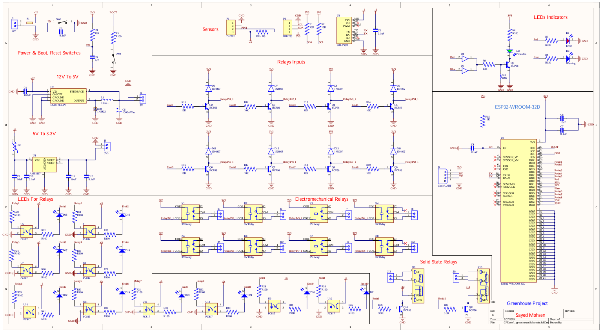
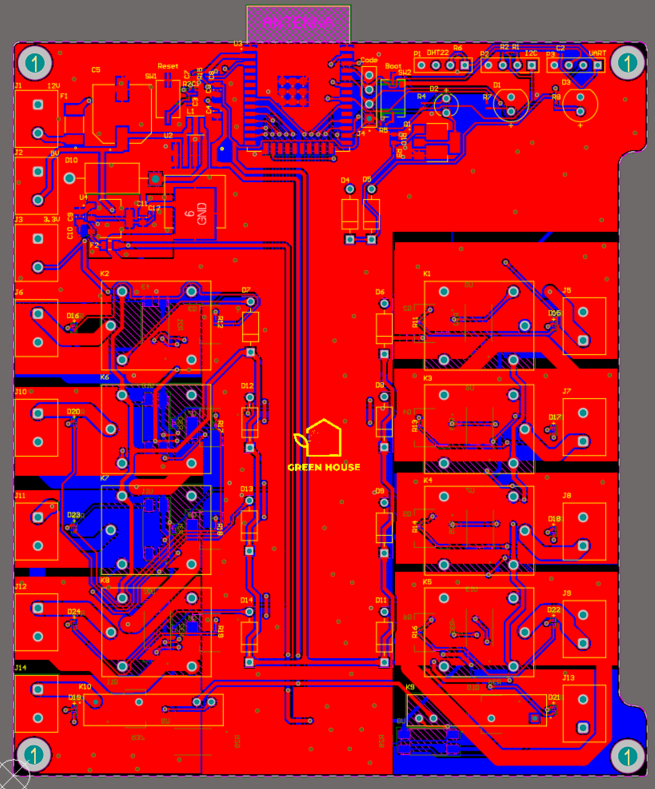
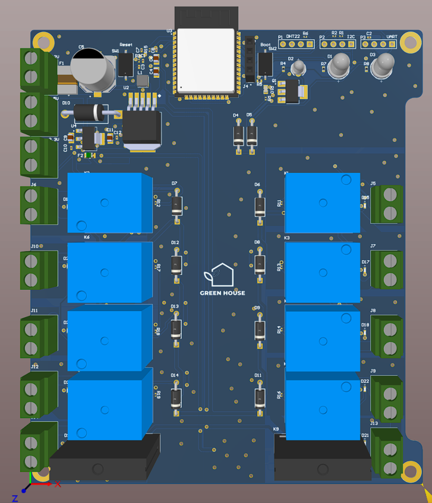
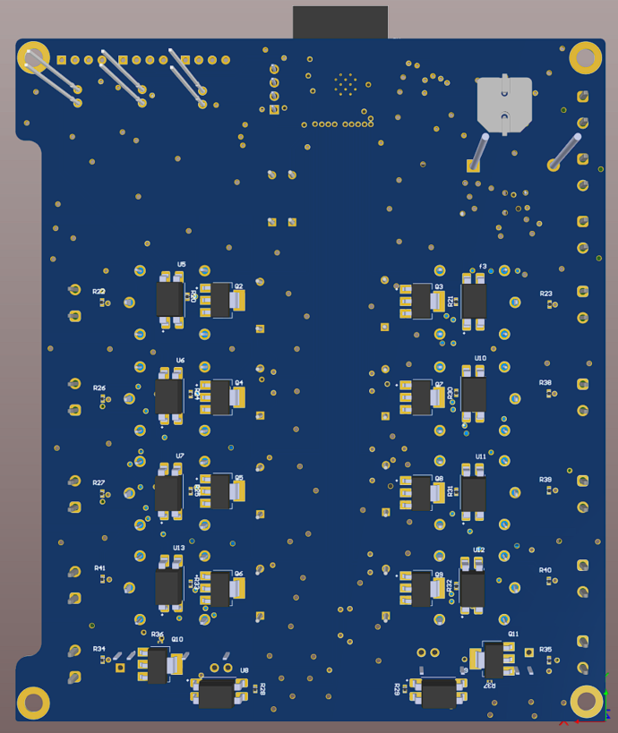

# Smart Greenhouse PCB System
This repository includes the design files and implementation of a custom Greenhouse Control PCB developed to automate and regulate key environmental functions in a greenhouse system using Altium Designer.

---

## ✨ Features

The smart greenhouse system is designed to provide comprehensive, automated environmental control.

* **Automated Environmental Monitoring:** Continuously monitors crucial parameters for plant health, including air temperature, humidity, $Co_{2}$ concentration, and light intensity.
* **Actuator Control:** Controls actuators such as fans, heaters, motors, misting systems, and LEDs. This includes controlling:
    * Heating (Ceramic Heaters)
    * Cooling and Ventilation (Fans)
    * Humidity (Misting Systems)
    * Grow lights and shading systems (Motors and LEDs)
* **Dual Control Modes:** Supports both automated logic and user-friendly manual control.
    * **Automatic Mode:** Central **ESP32-WROOM-32D** microcontroller manages data acquisition and control logic.
    * **Manual Override:** Switches/buttons allow the user to manually turn actuators on/off for testing or in case of system failure.
* **Scalability:** The design provides scalability for larger greenhouse applications.

---

## 🛠️ System Architecture & Components

### 1. Central Microcontroller

The system is centered around the **ESP32-WROOM-32D** module.

* **Key Functions:** Selected for its integrated Wi-Fi and Bluetooth connectivity, sufficient processing capability, and wide range of peripheral interfaces. It manages reliable monitoring and control of environmental parameters.
* **Low-Power Features:** Ensures energy efficiency.

### 2. Sensors

The PCB is designed to interface with the following sensors:

| Parameter | Sensor (Initial Selection) | Key Specifications |
| :--- | :--- | :--- |
| Temperature & Humidity | **DHT22** | Operates at 5V, output is 40-bit digital data, accuracy is $\pm0.5^{\circ}C$, $\pm2\%RH$. |
| $CO_{2}$ Concentration | **MQ-135** | Used to measure $Co_{2}$ in air.
| Light Intensity | **BH1750** | Used to measure light intensity.

### 3. Actuators and Relays

Actuators are connected via relays for switching high loads. The system uses:

* **Solid State Relays (SSR) - RE47:** Two SSRs are used, specifically for the 220V ceramic heaters, as they are precise, great for resistive loads, and allow fast switching (PWM).
    * **Output:** 24-380V AC, 40A max current.
* **Electromagnetic Relays (SLA30):** Eight electromagnetic relays are used for loads, specifically for AC Motor (shading system) and AC Fan (cooling), connected to a contactor before the load.
    * **Max Load:** AC 250V/30A, DV 30V/30A.

---

## 💡 Control Modes and Status Indicators

### Control Modes

Control is managed by **four SPDT switches**:

* **Global Mode Switch:** A single SPDT switch determines the operating mode (**Automatic** vs. **Manual**).
* **Actuator Override Switches:** Three actuator-specific SPDT switches enable manual override of the **fan**, **motor**, and **heater**.
* **Safety:** All logic-level signals from the switches are processed by the ESP32, ensuring safe, low-voltage control.

### Status Indicators

The PCB includes indicator LEDs to provide system feedback:

* **Power/Start LED (Green):** Indicates that the ESP32 board is powered and running.
* **Error LED (Red):** Signals system fault or abnormal operation.
* **Alarm LED (Yellow/Orange):** Activates when environmental thresholds (e.g., high temperature, $CO_{2}$) are exceeded.
* **Actuator Status:** Small LEDs indicators show the on/off status of the actuators.

---

## ⚡ Power System Design

The system requires a stable power distribution network.

* **Primary Power Source:** 220V AC mains input.
* **Step-down Conversion:**
    * 220V AC to **12V DC** power supply module for relays and contactors.
    * 12V to **5V DC** buck converter to power sensors (e.g., DHT22, MH-Z19B, TSL2561).
    * 12V to **3.3V** LDO or DC-DC buck converter to supply the ESP32-WROOM-32D.
* **Isolation and Protection:**
    * Fuses and circuit breakers for overcurrent protection.
    * **Optocouplers** for isolation between ESP32 GPIOs and relays/SSR.
    * Decoupling capacitors to reduce noise near microcontrollers and sensors.
* **Controls:** Dedicated reset push-button and a reboot button (used with reset for programming mode) for the ESP32.

---

## 🖼️ Design Screenshots

### PCB Schematic

The schematic illustrates the connections between the ESP32-Wroom-32D, sensors, relays, and power management circuits.

### PCB Design

These images show the finalized component placement and copper trace routing of the custom PCB in 2D and 3D view.

